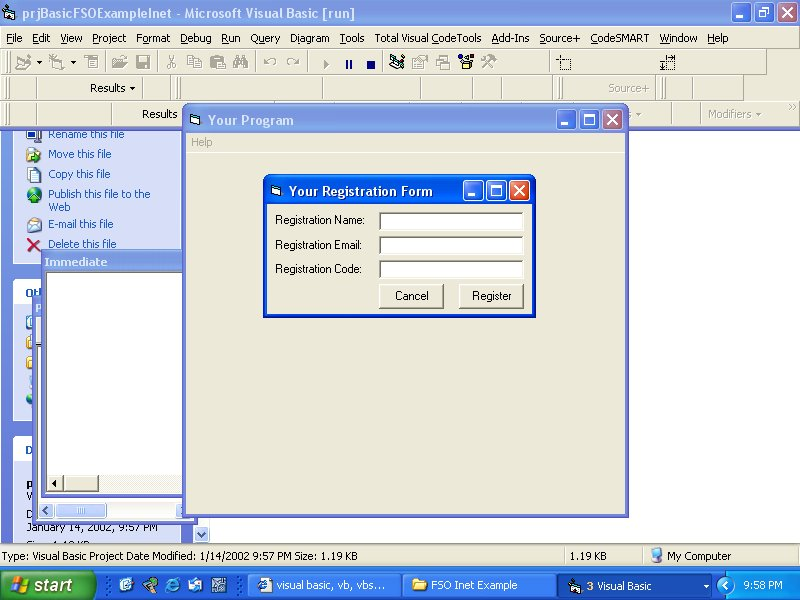



## Basic FSO, Inet Example

### Description

This is to show basic FSO & Inet use, it is a registration program that will create a temp.dat file, upload it and change the name to registered.dat and then delete the temp.dat on the users pc.

It is commented on almost every single line, it describes everything the coding is doing.

Basically made for beginners but to give intermediate and even experienced users some ideas.

Please Vote If You Find The Code Useful Or A Good Tutorial, Your Votes Are Much Appreciated.
 
### More Info
 

             |
---                |---
**Submitted On**   |2002-01-14 21:57:10
**By**             |[PorkNBeans](https://github.com/Planet-Source-Code/PSCIndex/blob/master/ByAuthor/porknbeans.md)
**Level**          |Beginner
**User Rating**    |5.0 (20 globes from 4 users)
**Compatibility**  |VB 5\.0, VB 6\.0
**Category**       |[Files/ File Controls/ Input/ Output](https://github.com/Planet-Source-Code/PSCIndex/blob/master/ByCategory/files-file-controls-input-output__1-3.md)
**World**          |[Visual Basic](https://github.com/Planet-Source-Code/PSCIndex/blob/master/ByWorld/visual-basic.md)
**Archive File**   |[Basic\_FSO,487101142002\.zip](https://github.com/Planet-Source-Code/porknbeans-basic-fso-inet-example__1-30805/archive/master.zip)

